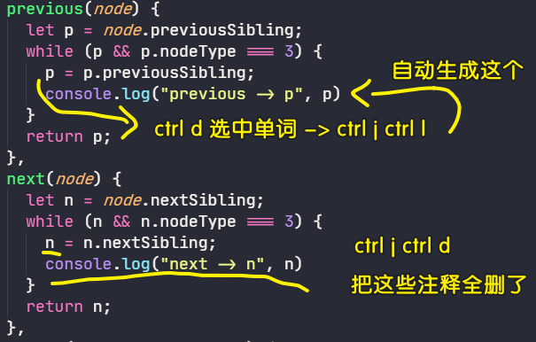
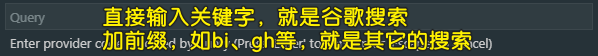
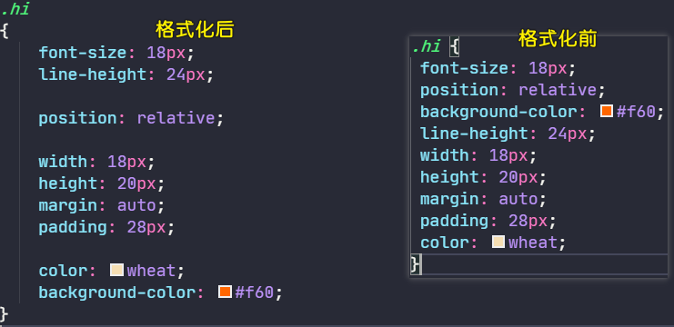
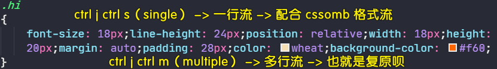
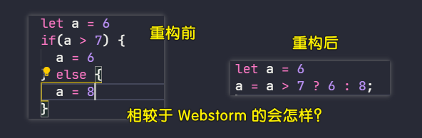

### ✍️ Tangxt ⏳ 2020-11-10 🏷️ vscode

# 01-快捷键 & 配置

## ★常用快捷键

## ★插件配置 & 自定义快捷键

### <mark>1）Turbo Console Log：让你不用手敲 log</mark>



```
ctrl+j ctrl+l 选中变量之后，使用这个快捷键生成 console.log

<!-- 不需要选中变量 -->
ctrl+j ctrl+c 注释（comment）所有 console.log
ctrl+j ctrl+u 启用所有（uncomment） console.log
ctrl+j ctrl+d 删除所有 （delete）console.log
```

### <mark>2）CodeBing：让你不用打开浏览器搜索内容</mark>



```
ctrl+j ctrl+f 谷歌搜索（你好）「这是默认的」，变量命名（c 你好），必应搜索（b 你好），b 站搜索（bi 前端），维基（wiki），油管（yt），GitHub（gh），Stack Overflow（so）
```

配置 `"codebing.defaultProvider": "g"`后，选中文本，直接摁 `ctrl+j ctrl+f`，就能直接谷歌搜索选中的内容了，无须弹框后再输入

Codelf：你可以把它的源码 `clone` 到 Gitee，然后启动 Gitee Pages 服务，这样访问速度就快很多了

### <mark>3）CSScomb：让你所写的 CSS 样式属性有顺序</mark>



配置：

``` json
{
  "csscomb.formatOnSave": true, // 保存时自动格式化
  "csscomb.preset": "csscomb" // 格式化模板，其它配置 zen，yandex
}
```

默认自带的 [`csscomb`格式化模板](https://github.com/csscomb/csscomb.js/blob/dev/config/csscomb.json) 是有 bug 的，所以你需要改一下：[代码片段](https://gitee.com/ppambler/codes/a34eg1p6qm2yklhfx8obs77#0-tsina-1-50393-397232819ff9a47a7b7e80a40613cfe1)

使用这个代码片段：

1. 在项目的根目录下新建`csscomb.json`
2. 把代码片段里边的代码拷进去

当然，你也可以直接配置 `"csscomb.preset"`，这样对于每一个项目而言就不用创建一个`csscomb.json`了，不过这配置内容很多，所以这并不推荐！

关于这个格式化模板，有人推荐用腾讯的 AlloyTeam：[Code Guide by @AlloyTeam](http://alloyteam.github.io/CodeGuide/#css-declaration-order) -> 你把`csscomb.json`里边的`"sort-order"`改成是 AlloyTeam 给出的样式属性书写顺序规范就好了！

### <mark>4）css-format-one-line：一个 CSS 选择器就只占一行，占太多的话，文件太长</mark>



### <mark>5）JavaScript Booster（重构你的 JS 代码）</mark>




